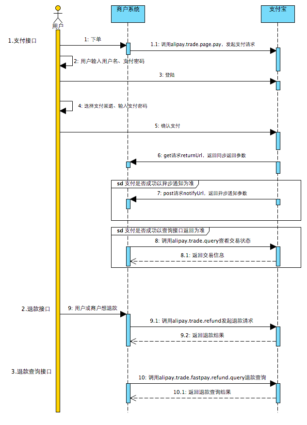
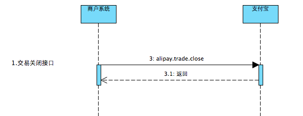

# pay应用接口说明

## 支付宝


### `/pay` 统一收单交易支付接口

- 参数
    - requestUrl*：支付完成同步跳转地址
	- bizContent*:业务参数请求集合

>说明：*为必传字段，下同

### `/pay2` 统一收单交易支付接口2

- 参数
    - outTradeNo*：商户订单号
	- totalAmount*：订单总金额
	- subject*：订单标题
	- returnUrl：支付完成同步跳转Url
	- notifyUrl: 异步通知支付结果Url
	- body：订单描述
	- productCode：销售产品码
	- goodsDetail：订单包含的商品列表信息
	- passbackParams：公用回传参数
	- extendParams：业务扩展参数
	- goodsType：商品主类型 0—虚拟类商品（默认），1—实物类商品
	- timeoutExpress：该笔订单允许的最晚付款时间 取值范围：1m～15d。m-分钟，h-小时，d-天，1c-当天 默认值：90m


### `/my_notify` 支付完成后请求此方法查询是否支付成功

- 参数
    - outTradeNo*：商户订单号
			
- 返回值（示例）
        
```
{
"success": true,
"message": "交易支付成功",
"notifyInfo": 
    {
    "outTradeNo": "20150320010101035",
    "outBizNo": null,
    "tradeNo": "2017082321001004100517932306",
    "buyerId": "2088702161295104",
    "sellerId": "2088721723496902",
    "totalAmount": "0.01",
    "receiptAmount": "0.01",
    "invoiceAmount": "0.01",
    "buyerPayAmount": "0.01",
    "pointAmount": "0.00",
    "gmtCreate": "2017-08-23 16:24:53",
    "gmtPayment": null,
    "tradeStatus": "TRADE_SUCCESS"
    }
}
```
				


### `/refund` 统一收单交易退款接口

- 参数 
    - outTradeNo*： 商户订单号		
	- refundAmount*：退款金额
	- refundReason：退款原因
	- outRequestNo：标识一次退款请求
	- operatorId：商户的操作员编号
	- storeId：商户的门店编号
	- terminalId：商户的终端编号

- 返回值
```
{
    "success": true,
    "message": ""
	}
```
    
    


### `/query_refund` 统一收单交易退款查询

- 参数
    - outTradeNo*：商户订单号
    - outRequestNo*：退款请求号
    
- 返回值
```
{
    "success": true,
    "message": ""
    }
```
    


### `/query` 统一收单线下交易查询接口

- 参数
    - outTradeNo*:商户订单号 
		
- 返回值（示例）
```
{
 "success": true,
 "message": "",
 "queryInfo": {
    "subCode": null,
    "subMsg": null,
    "code": "10000",
    "msg": "Success",
    "buyerLogonId": "130****6886",
    "buyerPayAmount": "0.00",
    "buyerUserId": "2088702161295104",
    "invoiceAmount": "0.00",
    "openId": "20881083700980698600446841018810",
    "outTradeNo": "20150320010101050",
    "pointAmount": "0.00",
    "receiptAmount": "0.00",
    "sendPayDate": "2017-08-29 18:06:12",
    "totalAmount": "0.01",
    "tradeNo": "2017082921001004100220158980",
    "tradeStatus": "TRADE_SUCCESS",
    "tradeStatusNote": "交易支付成功"
     }
}
```

### `/close` 统一收单交易关闭接口

- 参数
    - outTradeNo*:商户订单号
    - operatorId：卖家端自定义的的操作员ID
        
- 返回值
```
{
"success": true,
"message": ""
}
```


### 参考文档

- [电脑网站支付API列表](https://docs.open.alipay.com/270/105900/)


